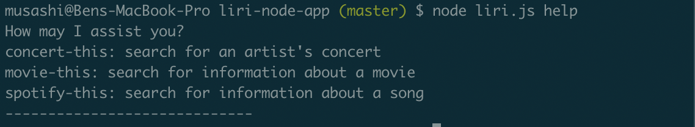
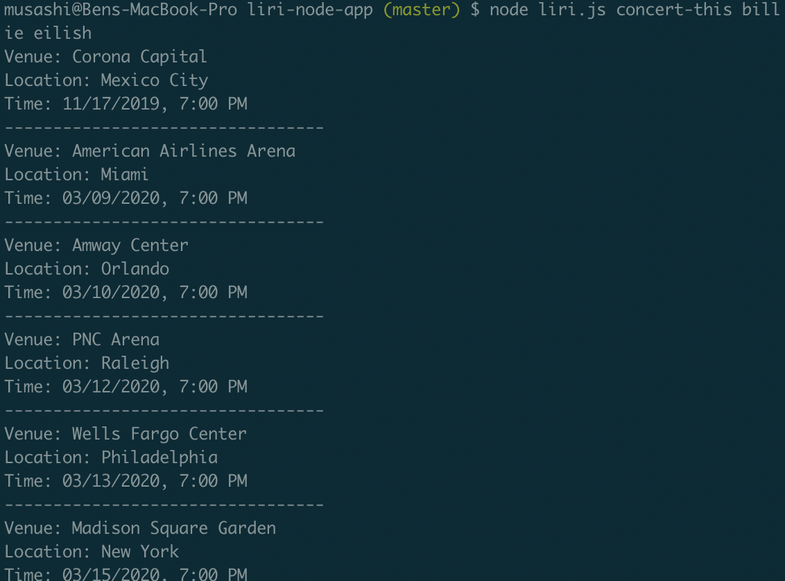
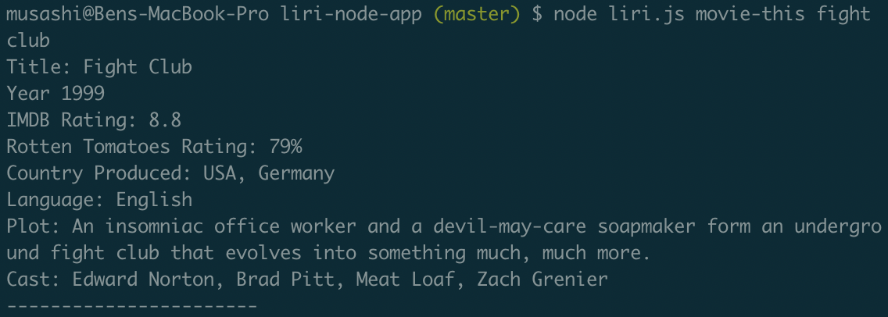
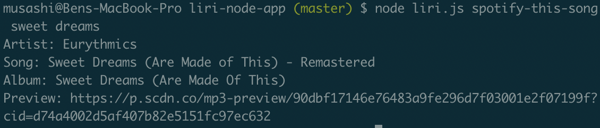
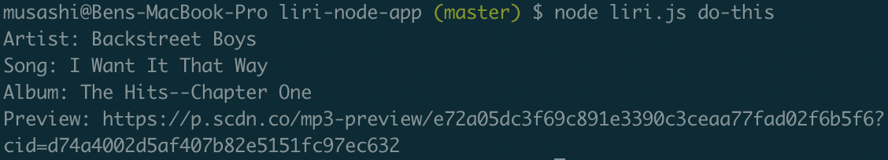
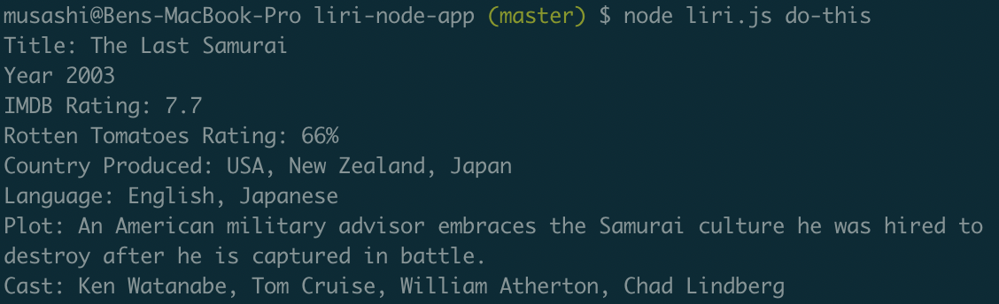
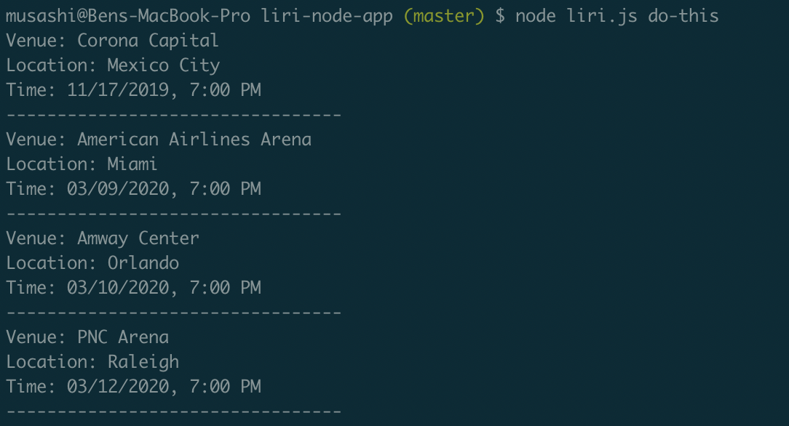
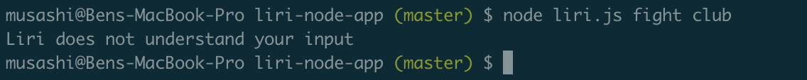

# liri-node-app
## Overview
The Liri App is essentially a miniaturized version of Apple's Siri. With the Liri App, the user can search for information on their favorite movie, their favorite song, or their favorite musical artist.
## Organization
The Liri App is organized into four seperate parts. The first part is the main Liri.js page. This page contains the code needed to read the instructions given by the user and determines which path it will search. The other three parts contain the spotify page, bands-in-town page, and the omdb page.
## How to Use the App
1. To use the app, begin by typing "node liri.js help". The help function will explain what to input in order to find the results the user is looking for.

2. To search for information regarding an artist's upcoming concerts, the user will type "node liri.js concert-this 'name of artist'. This will give the user a list of upcoming tour dates, the name of the venue, and what city they are located in.

3. To search for movie information, the user will type "node liri.js movie-this 'name of movie'. This will supply them with a list of information such as imdb rating, plot, cast, etc.

4. To search Spotify for song information, the user will type "node liri.js spotify-this 'name of song'. This will display the name of the song, the artist, and a link to a sample of the song.

5. To test the random.txt file, the user will type "node liri.js do-this". This will take whatever command and input is in the random.txt folder and display it.

6. If the user inputs the command incorrectly, the app will notify the user.

## Technologies Used
The primary technology used in this application is Node. In order to get the most functionality, various npm packages were installed. The Liri App dependencies are: Axios, dotenv, moment, and node-spotify-api. This app also uses the omdb api to search for movie information and the bands-in-town api to search for artists.

## My Role
This is a solo project. As the only developer, I analyzed and interpreted the needs, wants, and requirements of the Product Owner (Trilogy) and created a functioning application from top to bottom that met those expectations.
